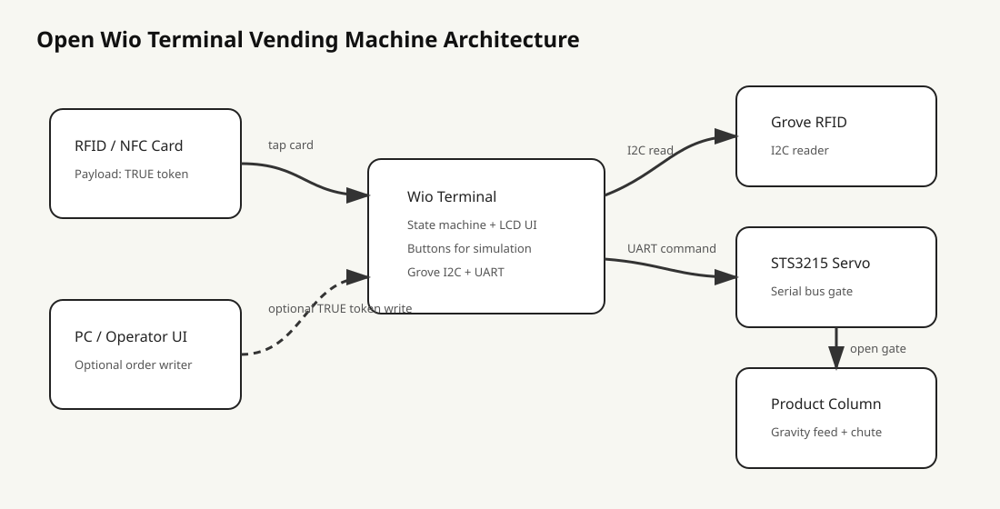
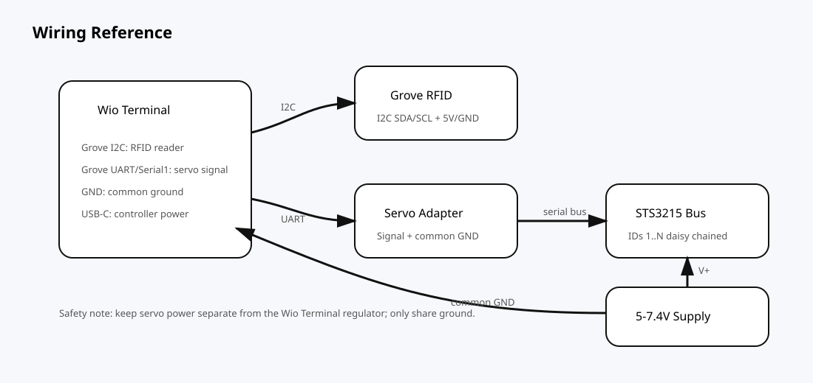

# Wio Terminal Open Vending Machine

A ready-to-go, fully open-source starter repo for a **Wio Terminal vending machine** inspired by the Fab Academy Chaihuo Week 12 XIAO vending-machine workflow.

This repo is intentionally original and MIT licensed. It does **not** copy Fab Academy source files, CAD files, photos, or student assets. The referenced Fab Academy pages are used as design references only.

## What it does



The machine has a simple tap-to-dispense flow:

1. User presents a paid token/card.
2. Wio Terminal validates the token.
3. LCD shows the transaction state.
4. Servo gate opens and closes to release one product.
5. Inventory counter decrements.

The default build runs in **simulation mode** so you can flash it immediately:

- Button A = valid paid card
- Button B = invalid card
- Button C = restock / reset stock

## Reference design choices

The Chaihuo group assignment describes a Wio Terminal reading a Grove RFID card over I2C, validating a `TRUE` payload, and driving two STS3215 serial-bus servos to release a XIAO board. Timothy's notes emphasize a lightweight, modular vending-machine structure where an RFID card activates a servo to dispense XIAO RP2040 / ESP32-C3 boards. Emily's notes document a modular two-section machine with a Wio Terminal mount, RFID tap point, retrieval area, PETG internal parts, and an L-shaped servo arm.

## Hardware BOM

A richer CSV BOM is available at `hardware/BOM.csv`.

| Item | Qty | Notes |
|---|---:|---|
| Seeed Wio Terminal | 1 | Main controller and LCD UI |
| STS3215 serial bus servo | 1-2 | Gate actuator; simulation mode works without this |
| Grove RFID reader/writer | 1 | Optional, for real card validation |
| External 5-7.4V servo supply | 1 | Do not power servos from the Wio Terminal 3V3 rail |
| Common GND wire | 1 | Required between Wio Terminal and servo power system |
| PETG printed product holder and servo arm | 1 | More durable than PLA for repeated actuation |
| Acrylic window | 1 | Optional, for visible stock |
| XIAO product stack/channel | 1 | Gravity-fed product magazine |

## Wiring overview



### Simulation mode

No external wiring needed.

### Servo mode

| Servo bus | Wio Terminal |
|---|---|
| Signal TX/RX adapter | Serial1 pins / Grove UART adapter |
| V+ | External servo supply |
| GND | External supply GND + Wio Terminal GND |

### RFID mode

Use the Grove I2C port for the RFID module. The firmware includes a clean token-reader abstraction so you can connect your RFID library in `CardReader.h` later without changing the vending state machine.

## Flash with PlatformIO

```bash
pio run -e wio_terminal_sim -t upload
```

Open the serial monitor:

```bash
pio device monitor -b 115200
```

## Arduino IDE

Open:

```text
firmware/wio_vending_machine/wio_vending_machine.ino
```

Install the Wio Terminal board support and `TFT_eSPI`. The default sketch is simulation-ready.

## Rich documentation included

- `docs/BUILD_GUIDE.md` - mechanical build steps, materials, and tuning checklist.
- `docs/MEDIA_REFERENCES.md` - extracted public media links and licensing notes.
- `docs/DEMO_SCRIPT.md` - shot list for recording an original demo video.
- `docs/OPEN_SOURCE_NOTES.md` - why this repo stays MIT-compatible.
- `docs/dashboard/index.html` - static PC dashboard mock for the optional order/RFID-writing flow.
- `docs/media/*.svg` - original open-source architecture, wiring, and mechanical diagrams.

## Repository layout

```text
firmware/wio_vending_machine/   Arduino firmware
hardware/                       Mechanical design notes, BOM, and placeholder CAD brief
docs/                           Assembly, state machine, diagrams, dashboard mock, media references
tools/                          Simple helper scripts / order-token notes
platformio.ini                  PlatformIO project config
LICENSE                         MIT license
```

## Next steps for a real build

1. Print a PETG holder and L-shaped servo arm.
2. Test product drop manually before adding electronics.
3. Flash simulation mode and test LCD/button flow.
4. Connect the servo and tune `HOME_POS` / `VEND_POS`.
5. Connect RFID and replace the simulated card reader with real block/token validation.
6. Add stock sensing or backend inventory sync.

## License

MIT. Use it, fork it, teach with it, or turn it into a real open-source vending-machine project.
