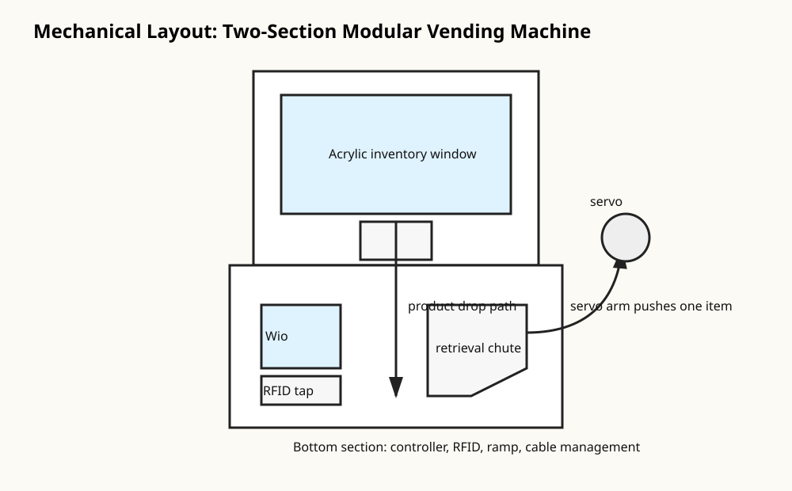

# Build Guide

## 1. Mechanical concept

This build uses a two-section vending machine:

- **Upper section:** transparent inventory window, vertical product column, refill hatch, servo gate.
- **Bottom section:** Wio Terminal mount, RFID tap point, retrieval chute, cable-management cavity, power entry.
- **Product path:** XIAO boards or similarly sized packaged products are stacked vertically and gravity-fed to the gate.
- **Release action:** the servo arm opens the gate briefly, allowing exactly one product to fall into the chute.

## 2. Material notes

Recommended prototype materials:

- PETG for holder, ramp, and servo arm. It is tougher than PLA and better for repeated impact/friction.
- Acrylic or clear PETG sheet for the window.
- M3 screws and heat-set inserts for serviceable joints.
- Separate printed holder module so a broken holder does not require reprinting the whole base.

## 3. Assembly steps

1. Print the lower base, retrieval chute, product holder, and servo arm.
2. Dry-fit one product into the holder. Add 0.5-1.0 mm clearance on each side for packaging variation.
3. Mount the Wio Terminal so the screen and A/B/C buttons are reachable.
4. Mount the RFID reader below or beside the screen with a clear tap icon.
5. Mount the servo so the arm can push/release the lowest product without hitting the holder wall.
6. Add a transparent front/side window so users can see stock.
7. Test the mechanism by hand before powering any servo.
8. Flash simulation firmware and validate the LCD flow.
9. Connect the servo bus and tune `HOME_POS`, `VEND_POS`, and timing in `Config.h`.
10. Add RFID validation once the mechanical path is reliable.

## 4. Mechanical tuning checklist

- [ ] One product drops per cycle, not zero and not two.
- [ ] Servo arm never collides with the product holder.
- [ ] Product falls without catching on screw heads or layer seams.
- [ ] Chute angle is steep enough for reliable sliding.
- [ ] Wires are clear of the servo and chute.
- [ ] Stock can be refilled without disassembling the machine.
- [ ] The Wio Terminal USB-C cable and servo power cable have strain relief.

## 5. Suggested dimensions to customize

These are starting points only. Adjust to your product package.

| Feature | Starting point |
|---|---:|
| Product side clearance | 0.5-1.0 mm each side |
| Product front/back clearance | 1.0-1.5 mm |
| Ramp angle | 25-40 degrees |
| Acrylic window thickness | 2-3 mm |
| Fasteners | M3 screws |
| Servo gate stroke | Tune by firmware |

## 6. Reliability notes

The most important test is mechanical repeatability. Make the manual push test work for 20-30 cycles before servo tuning. Then run the servo with no stock, then with one product, then with a half-full column, then full stock.
